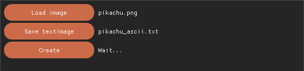
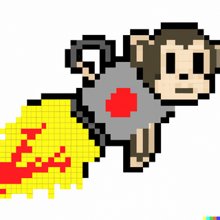

# Image to Text

A desktop tool, built with [Dear PyGui](https://github.com/hoffstadt/DearPyGui), that converts any
photo into a plain-text ASCII-art file. This is the original Python version — the predecessor to
[ascii.virag.fun](https://ascii.virag.fun), which reimplements the same core idea as an in-browser
web app.



## How it works

1. **Measure how "dark" each printable ASCII character actually looks.** For every character from
   `!` (33) to `~` (126), the app renders it at 100pt and counts how many white pixels it covers on
   a blank canvas. Sorting characters by that count gives a real, measured density ramp — from the
   sparsest character to the densest — rather than a guessed string like `` ` .:-=+*#%@``.
2. **Resize the source image** so its longer side is 105px, keeping the aspect ratio.
3. **Compute each pixel's perceived luminance** using the standard Rec. 709 weighting
   (`0.2126×R + 0.7152×G + 0.0722×B`), giving a single brightness value per pixel.
4. **Map each pixel's luminance to a character** from the density ramp: the 0–255 luminance range is
   split into as many equal steps as there are candidate characters, and each pixel's step picks its
   character from the sorted ramp. Every character is written twice, side by side, to roughly
   correct for monospace glyphs being taller than they are wide.

The result is a `.txt` file where the character density visually reconstructs the image — here's a
genuine run of this exact algorithm against the "Rocket Monkey" logo (the author's own mark, also
used in [sudoku-game](https://github.com/kvirag-fun/sudoku-game) and
[color-spy](https://github.com/kvirag-fun/color-spy)), shrunk down from the app's default 105px
resolution so it fits in a README:



```
NNNNNNNNNNNNNNNNNNNNNNNNNNNNNNNNNNNNNNNNNNNNNNNNNNNNNNNN
NNNNNNNNNNNNNNNNNNNNNNNNNNNNNNNNNNNNNNNNNNNNNNNNNNNNNNNN
NNNNNNNNNNNNNNNNNNNNNNNNNNNNNNNNNNNNNNNN00ddddddddMMNNNN
NNNNNNNNNNNNNNNNNNNNNNNNNNNNNNNNDDXXmm&&LL""""""""eeNNNN
NNNNNNNNNNNNNNNN@@BBmmJJJJAAMMppss{{{{]]||vvllllll\\aaWW
NNNNNNNNNNNNNNNNQQLLii!!((==YYZZ>>hhYYxx77AA22]]eeqq<<[[
NNNNNNNNNNNNNNNNCC\\ff$$nn((LLaa::33}}>>hhSSKKKKUUZZyy}}
NNNNNNNNNNNNNNNNii==nn9944^^!!<<rrkkff>>VVrreeBBCC~~hhLL
NNNNNNNNNNNNNNNNFF<<}}))ww**LLeeFFll>>??%%**hhMMJJ__33<<
NNNNNNNNNNNNNNNN@@hheewwxxFFaa33aa??//>>22aa44TT55nnll77
NNNNNNNNNNNNNNNNNNNNnn!!IIZZ33hh33ww==ffOO8899$$DD88{{22
NNNNNNNNNNHHddddddhhjjIIhh33FFLLTThhCC]]99ggXXooSSbbuu33
NNNNNNqqZZ}}jjjjzz;;ttXX33wwttccccuu44YY}}%%ooFFFFxx22@@
NNNN@@XX11pp88QQDDii**ooaaYYiivvccCC33ZZJJvv11yyII00NNNN
NNNNWW00QQ00##RR66<<;;^^%%%%77ttYY%%hh3322>>ddNNNNNNNNNN
@@WWRRRRRRbb##RR00$$>>rrLLoohheehhhhaaVVtt%%MMNNNNNNNNNN
QQ##qqyyyyXX######00GG??;;zz44ZZhh55kkYYuuNNNNNNNNNNNNNN
88RR99yyeeRRRRRRRR##QQff^^((ffCC}}hhuu{{uuNNNNNNNNNNNNNN
RRRRwwuu##RR00ddddRRRR&&LLvv}}ll~~33IIssJJNNNNNNNNNNNNNN
88PPxxZZ66RR99hhbb##0000wwhhNN55;;TT}}]]AANNNNNNNNNNNNNN
SSJJZZddhhaaYYhhnn99GGqqaaWWNNZZ[[hh}}wwNNNNNNNNNNNNNNNN
ii[[JJzzssss55VVee00}}55NNNNNNPP\\LL33NNNNNNNNNNNNNNNNNN
cciittIIppHHRR####00hhddNNNNNNMM88QQNNNNNNNNNNNNNNNNNNNN
hhaammQQ00RRRR8800QQBBNNNNNNNNNNNNNNNNNNNNNNNNNNNNNNNNNN
4488ggRRBB@@QQ@@@@NN@@NNNNNNNNNNNNNNNNNNNNNNNNNNNNNNNNNN
BB@@NN@@@@NNMMNNNNNNNNNNNNNNNNNNNNNNNNNNNNNNNNNNNNNNNNNN
NNNNNNNNNNNNNNNNNNNNNNNNNNNNNNNNNNNNNNNNNNNNNNNNNNNNNNNN
NNNNNNNNNNNNNNNNNNNNNNNNNNNNNNNNNNNNNNNNNNNNNNNNNNNN88pp
```

## Workflow

The window walks you through three steps, each button enabling the next once its input is ready:

1. **Load image** — opens a built-in file browser (shown above) filtered to `.png`/`.jpg`/`.jpeg`.
2. **Save textimage** — pick where the output `.txt` should be written.
3. **Create** — runs the conversion and writes the file.

## A real platform quirk

`sort_ascii_char()` loads its font as `ImageFont.truetype('Menlo.ttc', 100)` — just a filename, no
path. Menlo ships with macOS, so this resolves there via the system font search path; on Windows or
Linux it isn't found and `Create` fails with `OSError: cannot open resource`. If you're not on
macOS, point that line at a monospace font you do have (e.g. DejaVu Sans Mono, Consolas) to get the
same result — the algorithm itself doesn't care which font it measures, only that it's monospace.

## Requirements

- Python 3.10 or 3.11
- [Dear PyGui](https://github.com/hoffstadt/DearPyGui) and [Pillow](https://pillow.readthedocs.io/)
- A display — this is a desktop GUI app, not a headless/console one
- macOS (for the bundled `Menlo.ttc` reference — see above for other platforms)

## Running it

```bash
git clone https://github.com/kvirag-fun/img-to-text.git
cd img-to-text

python3 -m venv venv
source venv/bin/activate        # on Windows: venv\Scripts\activate

pip install dearpygui pillow

python code_to_text.py
```

Load one of the included sample images (or your own), choose a save location for the `.txt`
output, then click **Create**.

## Project structure

```
code_to_text.py        The entire app: file dialogs, resizing, luminance mapping, character ramp
colors.py               Retro color palette used for buttons
ascii_num_to_char.txt   Reference dump of the printable ASCII range (33-126) used during development
image_text.txt          A sample conversion output, checked in for reference
test.py                 Unrelated scratch file from experimenting with Dear PyGui theming — not
                        part of the app
*.png / *.jpg / *.jpeg  Sample images for trying the converter
```

## License

MIT — see [LICENSE](LICENSE).
